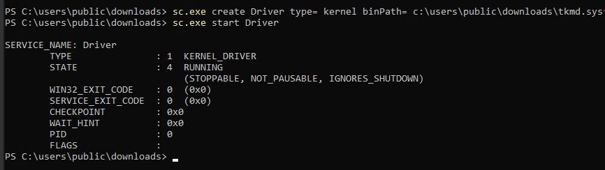
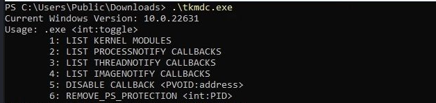
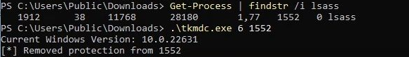
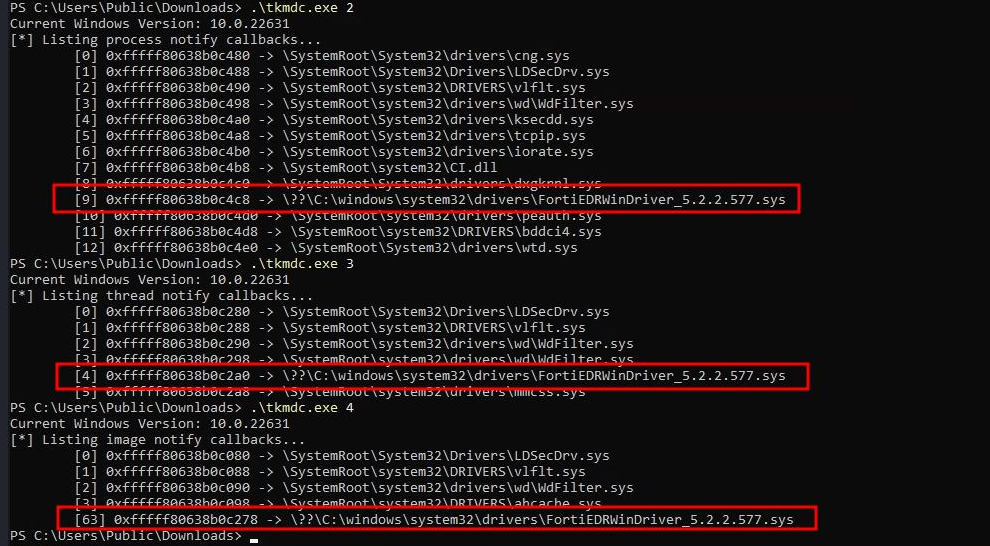
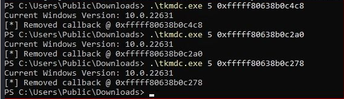
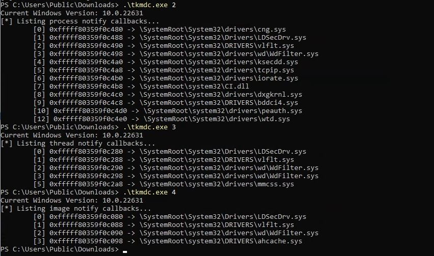

# tKMD + tKMDc
trovent Kernel-Mode Driver\
+\
trovent Kernel-Mode Driver communicator

# Usage: 
- Load driver\

- Start driver communicator\

- Remove PS_PROTECTION from LSASS process\

- Locate callbacks\

- Remove process, thread and image callbacks\

- Verify\

# Offsets
are already provided for the following builds:
- 10.0.26100
- 10.0.22621
- 10.0.22631
